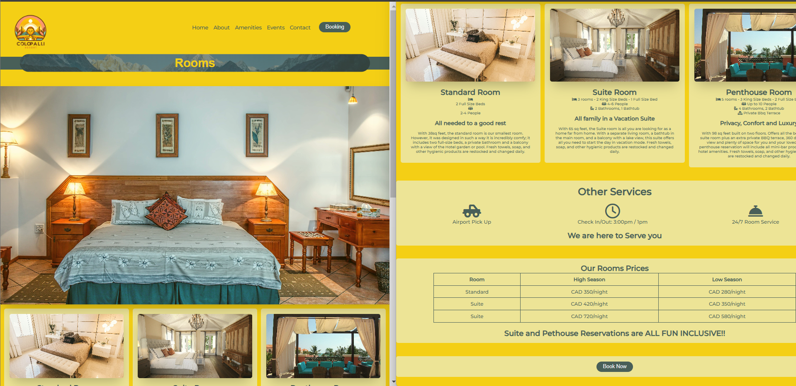
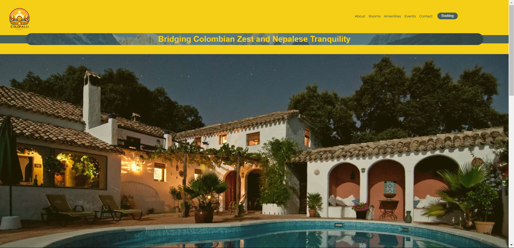
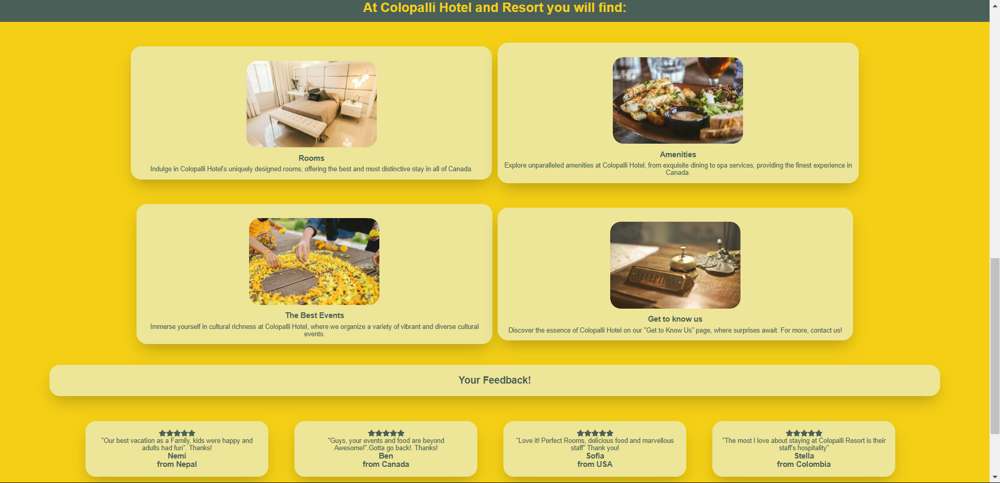

# Colopalli Resort & Spa Website


A responsive website designed to showcase the unique fusion of Nepali and Colombian culture at Colopalli Resort & Spa. Built with a mobile-first approach, this site highlights accommodations, amenities, events, and booking functionalities.

## 🌟 Features

### Frontend
- **Responsive Design**: Mobile-first layout using Flexbox and CSS Grid.
- **Interactive Elements**: Image sliders for rooms and amenities, embedded maps, and video galleries.
- **Forms**: Contact and booking forms with client-side validation.
- **Typography**: Clean and readable "Montserrat" font.
- **Color Palette**: Warm yellows and professional grays for brand consistency.
- **Graphics**: High-quality banners, service images, and SVG icons.

### Pages
- **Home**: Overview of services and cultural experiences.
- **About Us**: Hotel history and mission.
- **Services**: Room types with image sliders.
- **Amenities**: Restaurant, spa, and pool visuals.
- **Events**: Cultural festivals and family activities.
- **Contact**: Location map and contact form.
- **Booking**: Secure reservation system.

## 🎨 Design

### Color Palette
<div style="display: flex; gap: 10px;">
  <div style="background-color: #EDE597; width: 50px; height: 50px; border-radius: 8px;"></div>
  <div style="background-color: #F4CF15; width: 50px; height: 50px; border-radius: 8px;"></div>
  <div style="background-color: #495F58; width: 50px; height: 50px; border-radius: 8px;"></div>
</div>

### Typography
- **Font Family**: Montserrat (Google Fonts)
- **Weights**: Regular, Medium, Bold


## 🛠 Technologies Used
- **HTML5** & **CSS3**
- **JavaScript** (for sliders and form validation)
- **Git** (Version Control)
- **Figma** (Wireframes - [View Drafts](https://via.placeholder.com))

## 🚀 Installation
1. Clone the repository:
   ```bash
   git clone https://github.com/yourusername/colopalli-resort.git



